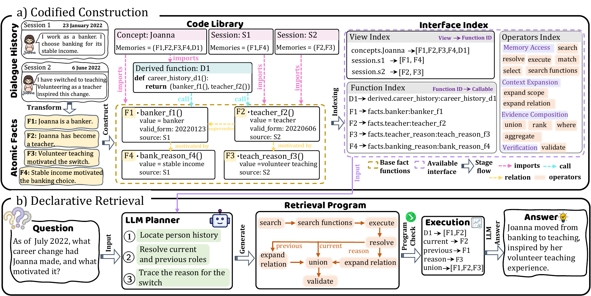

# Memory as Code (MaC)

## Overview

MaC is a unified long-term-memory framework for LLM agents. It compiles dialogue facts into reusable executable memory, then translates each question into a validated retrieval program. The retrieved evidence preserves canonical fact identities and source-dialogue provenance for answer generation and inspection.

MaC has two connected components:

1. **Codified Construction.** Atomic dialogue facts become a three-layer executable memory: fact functions, explicit fact/state relations, and reusable derived computations. Concept and session views share references to the same canonical facts.
2. **Declarative Retrieval.** A compact memory index exposes callable capabilities and permitted operators. The planner compiles a question into one complete constrained retrieval program; the executor validates and runs it in a sandbox, then passes provenance-carrying evidence to the answer model.

The framework is illustrated below.

<p align="center">
  <a href="assets/framework.png"></a>
  <br>
  <em>Figure 1: The overall framework of MaC, consisting of Codified Construction and Declarative Retrieval.</em>
</p>

The design provides reusable memory computations, complete one-plan retrieval instead of repeated stepwise planning, and per-question execution traces containing generated programs, validation outcomes, repair attempts, fact IDs, and source references.

## Run the Codes

### Repo Introduction

```text
MaC/
├── code/                           # MaC implementation
│   ├── main.py                     # CLI entry point and pipeline orchestration
│   ├── memory_extractor.py         # atomic-fact extraction
│   ├── memory_builder.py           # canonical facts, deduplication, and fact graph
│   ├── semantic_compiler.py        # executable memory, indexes, and state links
│   ├── retrieval_pipeline.py       # code, lexical, graph, and context retrieval
│   ├── program_executor.py         # planner, validator, and sandbox execution
│   ├── qa_engine.py                # evidence-grounded answer generation
│   ├── evaluator.py                # F1 and binary LLM-Judge evaluation
│   └── llm_client.py               # Qwen, DeepSeek, and official OpenAI adapters
├── data/
│   ├── locomo10.json               # LoCoMo input
│   └── dataset_LM.json             # LongMemEval input
├── assets/framework.png            # framework figure
├── prompts/                        # reference prompt documents
├── .env.example                    # API credential template
├── requirements.txt                # Python dependencies
└── README.md                       # this file
```

### Environmental Requirements

MaC requires Python 3.10 or later and the Python packages in `requirements.txt`: `openai`, `httpx`, `pydantic`, `python-dotenv`, `tqdm`, `nltk`, `regex`, and `sentence-transformers`.

Install the dependencies:

```bash
git clone <YOUR_REPOSITORY_URL>
cd MaC

python -m venv .venv
source .venv/bin/activate
pip install -r requirements.txt
```

### Model and API Configuration

Copy the example configuration and populate only the variables needed for the selected provider:

```bash
cp .env.example .env
```

```dotenv
# Qwen through an OpenAI-compatible endpoint
QWEN_API_KEY=...
QWEN_BASE_URL=https://<your-qwen-compatible-endpoint>/v1
QWEN_MODEL=qwen3.6-27b

# DeepSeek
DEEPSEEK_API_KEY=...
DEEPSEEK_BASE_URL=https://api.deepseek.com
DEEPSEEK_MODEL=deepseek-v4-flash

# GPT through the official OpenAI Responses API
OPENAI_API_KEY=...
OPENAI_MODEL=gpt-5.6-luna

# Optional binary Judge. Empty JUDGE_* values fall back to DEEPSEEK_*.
JUDGE_API_KEY=...
JUDGE_BASE_URL=https://api.deepseek.com
JUDGE_MODEL=deepseek-v4-flash
```

| `--llm` value | API transport | Configuration |
| --- | --- | --- |
| `qwen` | OpenAI-compatible Chat Completions API | `QWEN_API_KEY`, `QWEN_BASE_URL`, `QWEN_MODEL` |
| `deepseek` | DeepSeek OpenAI-compatible API | `DEEPSEEK_API_KEY`, `DEEPSEEK_BASE_URL`, `DEEPSEEK_MODEL` |
| `gpt` | Official OpenAI Responses API | `OPENAI_API_KEY`, `OPENAI_MODEL` |

Use `--model` to select another model available to your account that supports the selected API and disabled reasoning. The GPT adapter uses the OpenAI SDK's Responses API with an API key and does not use local Codex authentication. Candidate and Judge requests always disable reasoning/thinking.

### Running MaC

Run the following commands from the repository root. Each provider can be paired with either dataset.

Run a small end-to-end smoke experiment:

```bash
python -m code run-all \
  --llm deepseek \
  --dataset locomo \
  --max-samples 1 \
  --max-questions-per-sample 1 \
  --output outputs/smoke_locomo_deepseek
```

Run the full pipeline:

```bash
# LoCoMo with Qwen
python -m code run-all --llm qwen --dataset locomo --judge

# LongMemEval with DeepSeek
python -m code run-all --llm deepseek --dataset longmemeval --judge

# LoCoMo with an OpenAI model available to your account
python -m code run-all --llm gpt --model gpt-5.6-sol --dataset locomo --judge
```

The stages can also be run independently:

```bash
# Build executable memory
python -m code build-memory --llm deepseek --dataset longmemeval

# Answer questions with completed memory
python -m code run-qa --llm deepseek --dataset longmemeval

# Compute token-F1 and optional binary LLM-Judge results
python -m code eval --llm deepseek --dataset longmemeval --judge

# Complete construction-cost reports for an existing build
python -m code backfill-construction-cost --llm deepseek --dataset longmemeval
```

### Command-line Arguments

| Argument | Description |
| --- | --- |
| `--llm {qwen,deepseek,gpt}` | API adapter used for candidate generation. |
| `--model MODEL` | Overrides the provider model configured in `.env`. |
| `--dataset {locomo,longmemeval}` | Benchmark dataset. |
| `--data PATH` | Overrides the default dataset JSON path. |
| `--output PATH` | Root directory for generated artifacts. It must be inside this repository. |
| `--max-samples N` | Limits the number of dialogue samples. |
| `--samples-per-category N` | Selects a balanced LongMemEval subset; cannot be used with `--max-samples`. |
| `--max-questions-per-sample N` | Limits questions answered for each selected sample. |
| `--force` | Rebuilds memory artifacts when used with `build-memory` or `run-all`. |
| `--judge` | Enables binary LLM-as-Judge evaluation. |
| `--pred-suffix TEXT` | Adds a suffix to prediction and evaluation files. |
| `--build-workers N` | Concurrent memory-building workers. |
| `--semantic-workers N` | Concurrent semantic-compilation workers. |
| `--qa-workers N` | Concurrent question-answering workers. |
| `--judge-workers N` | Concurrent Judge workers. |
| `--llm-max-concurrency N` | Global concurrent API request limit. |

All stages are resumable. Run `python -m code <command> --help` to view the arguments accepted by a particular command.

### Outputs and Reproducibility

The default output root is `outputs/<dataset>/<llm>/` and includes the following main files:

```text
outputs/<dataset>/<llm>/
├── run_config.json                 # provider, model, dataset, no-thinking settings
├── <sample_id>/                    # per-sample memory artifacts
│   ├── atomic_facts.jsonl
│   ├── facts_by_id.json
│   ├── fact_graph.json
│   ├── semantic_specs.json
│   ├── function_index.json
│   ├── view_index.json
│   └── memory_code/
├── predictions/
│   ├── stage_checkpoints/<sample_id>/question_<NNN>/
│   ├── predictions.jsonl
│   ├── cost_summary.json
│   ├── cost_all.json
│   └── <dataset>_table_summary.json
└── result_summary.md
```
